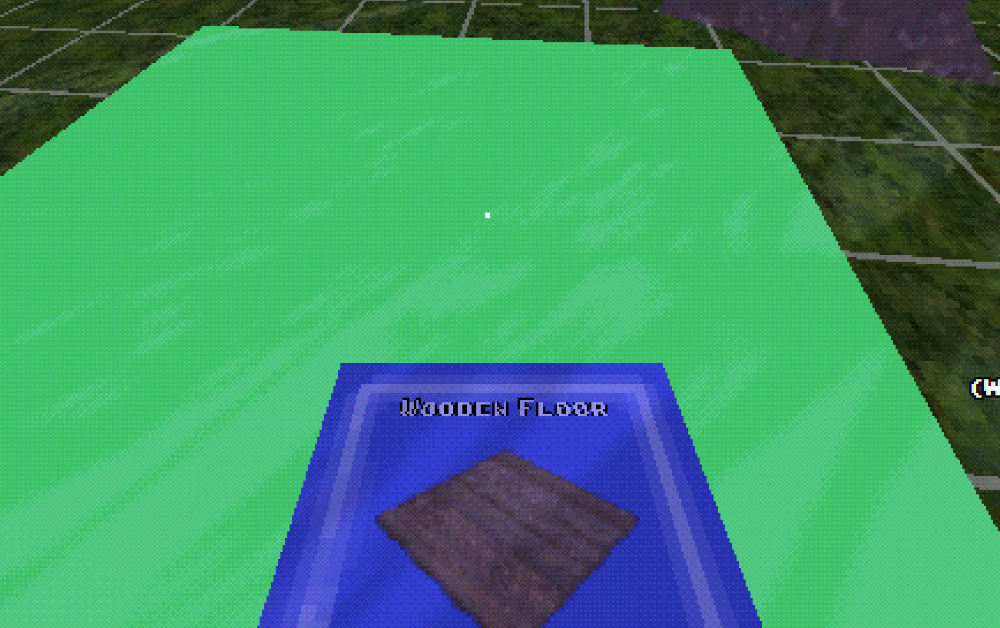

---
authors:
  - scriptsengineer
categories:
  - Nevoa
date: 2024-05-17
pin: false
draft: false
slug: creating-a-safe-place
---

# Creating a safe place

Building systems are something I always wanted to have in Nevoa, although some games I used as reference, such as The Long Dark, do not have building systems.
Having an interesting building system is something that complements any survival.

Still very simple, the building system can be seen in the video below:

<!-- more -->

<iframe width="560" height="315" src="https://www.youtube.com/embed/Z5fa4WDFxew?si=LYscU92EcU7RTr51" title="YouTube video player" frameborder="0" allow="accelerometer; autoplay; clipboard-write; encrypted-media; gyroscope; picture-in-picture; web-share" referrerpolicy="strict-origin-when-cross-origin" allowfullscreen></iframe>

I created a blueprint item that shows the player the current building, where they can open a menu and modify the current building:

## Tech Challenge 💪

It is based on plugs similar to what Rust and Unturned do, but I want this system not only to be for buildings that the player creates, but for all existing buildings in the world that the player will find/explore, similar to what happens in Project Zomboid, where if I find a diner I can simply dismantle or improve it, turning it into my new zombie apocalypse base 🛖.

I have a big technical challenge because the Zomboid project must use all (or many) construction objects as a single object, like Minecraft does with chunks. This is done to optimize both graphics processing and network communication. If this is not done, this system could be detrimental to a very large world.

My future plans are to create a construction that, when placed, still requires the use of a 🔨 hammer to complement the resources needed for construction.

## 📆 Plans to publish?

I'm currently trying to complete a gameplay cycle that is scheduled for version 0.1.0, which will have the entire survival cycle: crafting, surviving, and exploring. All of this is scheduled for the end of the year, which means that I believe that by the end of the year there will be an alpha on Steam for everyone to play. I think that will be the time when I will also open the page for wishlists, but I don't plan on doing that right now, because I want the page to reflect exactly what the game has, without promising anything exaggerated.