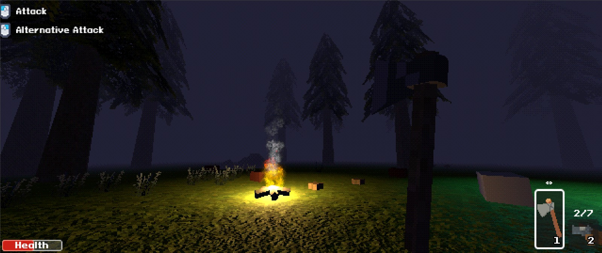

---
authors:
  - scriptsengineer
categories:
  - General
  - Expresso Bits
  - Nevoa
date: 2024-05-08
pin: false
draft: false
slug: first-post
---

# "Initial commit"?

This is my first post 🥳. After a long afternoon working and reading about [MkDocs](https://squidfunk.github.io/), I finally managed to put together a simple and static blog to keep everyone updated on the developments of Expresso Bits games, especially the new multiplayer game for Steam, Nevoa. I think few people don't know, but this project I've been doing is in Godot, I really gave up on Unity a long time ago and I imagine this is a topic for another post 🤔.

<!-- more -->

<figure markdown="span">
  
  <figcaption>Images of nevoa game. Ignore this UI, it's not final obviously</figcaption>
</figure>

Soon I want to post some retroactive posts from the last few months of development with Nevoa. I'm really looking forward to creating a community and a survival game that's a good simulator of how to die 💀.

I found it incredible how easy it is to create a blog in this system. I basically use markdown files, as if I were editing documentation for some open source library on GitHub.
At the time of this post, I also created a website with mkdocs for the [inventory system plugin](https://expressobits.com/inventory-system-docs), which is very messy, but still much better than having nothing at all.

## Plugins

I'm trying to see if I can give some attention to plugins this week, especially with the inventory system that has been asking for a loot system for a while now. My intention is to add a new tab to the editor so that it has the option to create a list of possible loots as if it were a profile to be placed on each item in the game that has loot. (Zombie bodies, chests, etc.)

To do this, I also want to move the editor codes to C++, motivated after having seen the editor codes for [LimboAI](https://github.com/limbonaut/limboai), a plugin for Godot in C++ that creates state trees, very incredible by the way, I will certainly use it to create the AI ​​behaviors of the zombies.

<figure markdown="span">
  
  <figcaption>Images of limbo AI plugin for godot</figcaption>
</figure>

